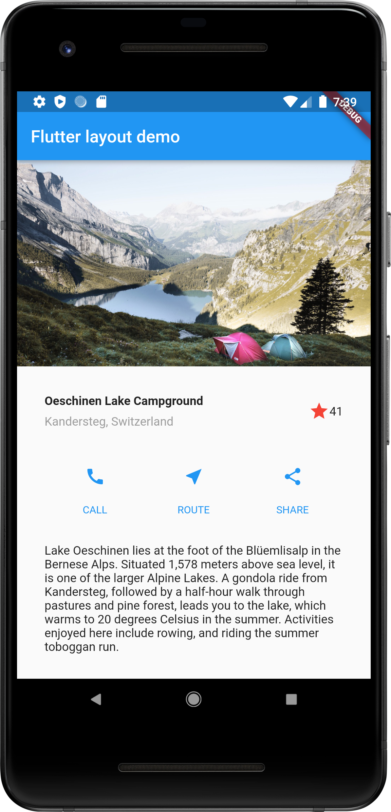
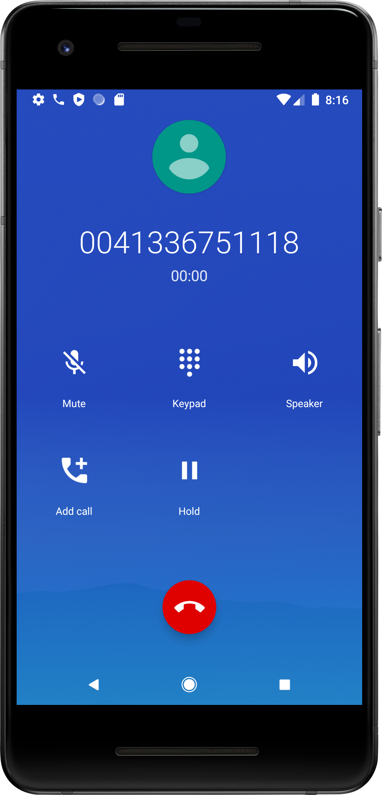
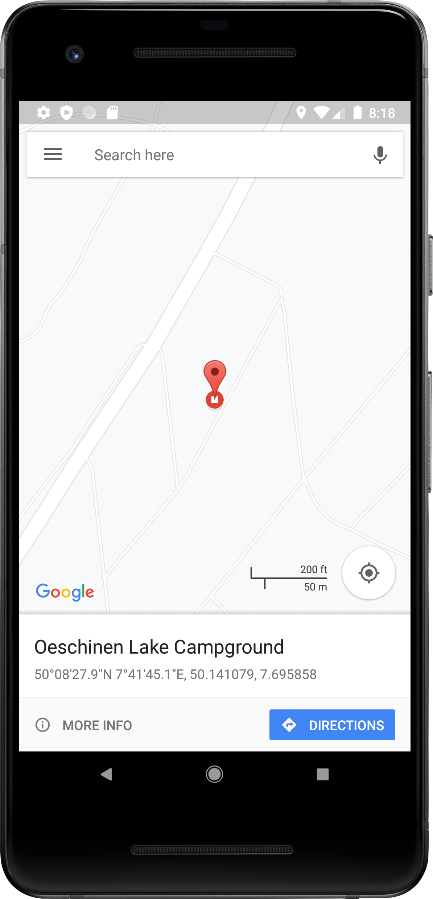
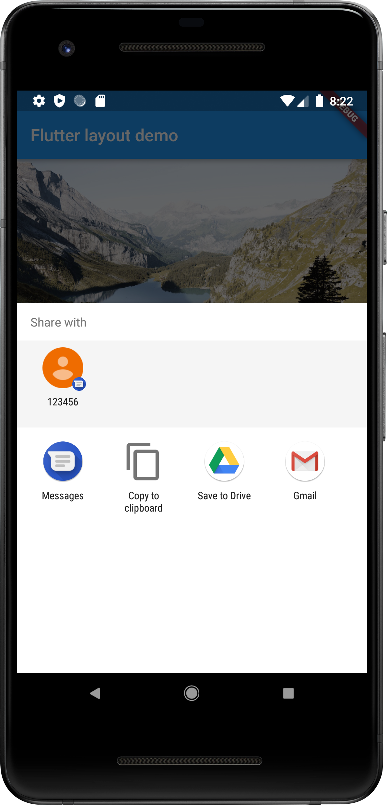
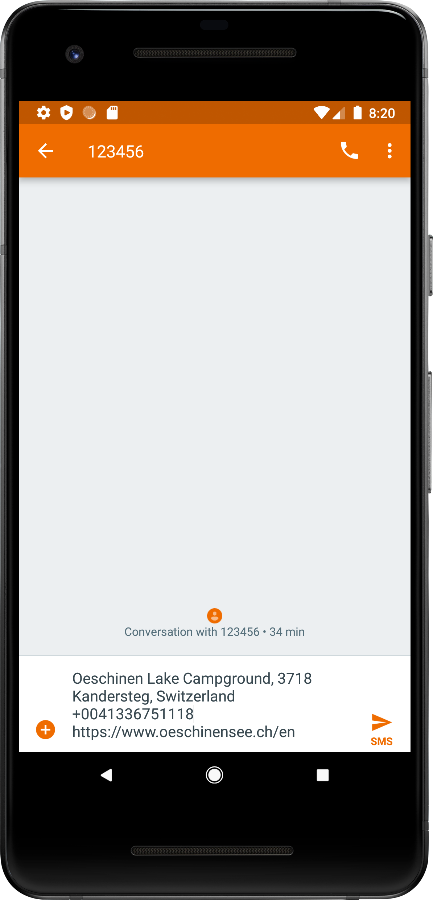

# SOFE4640 Assignment 2 - Flutter Project
Rutvi Shah - 100747171
## Objective:
Practice Flutter application development, specifically widgets.
## App Layout:
|     Page     |                                                                                                  Image                                                                                                  |
|:------------:|:-------------------------------------------------------------------------------------------------------------------------------------------------------------------------------------------------------:|
|  Home Page   |                                                                                                      |
| Call Button  |                                                                                                                |
| Route Button |                                                                                                              |
| Share Button |   |
